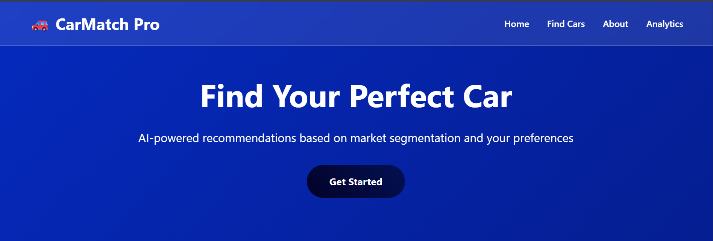
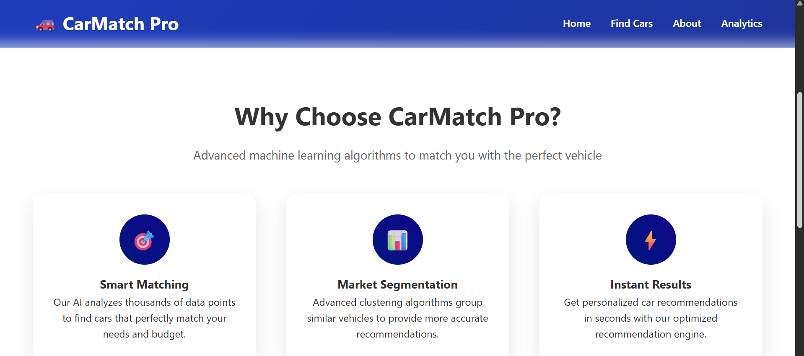
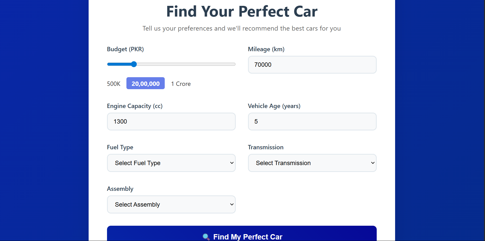
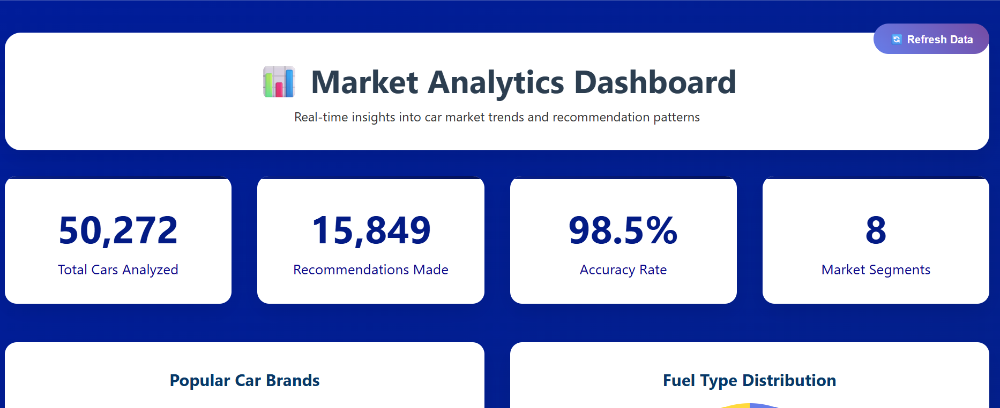
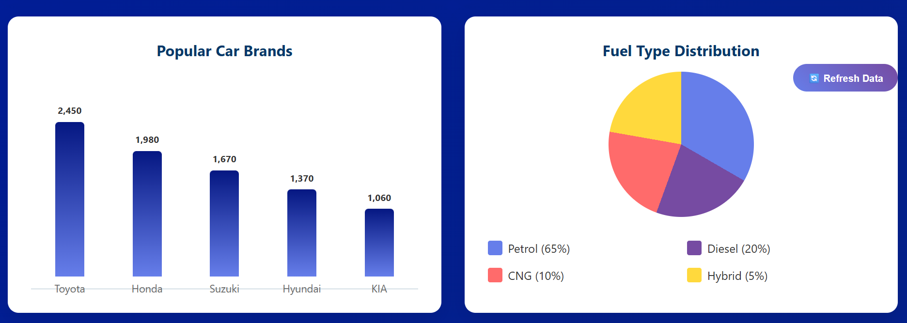
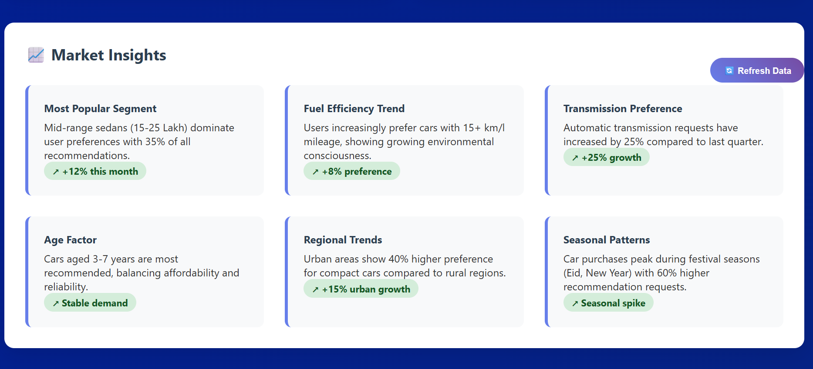
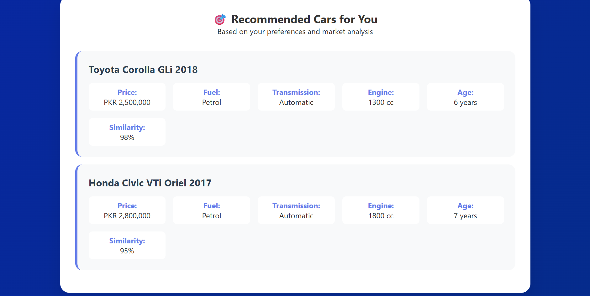
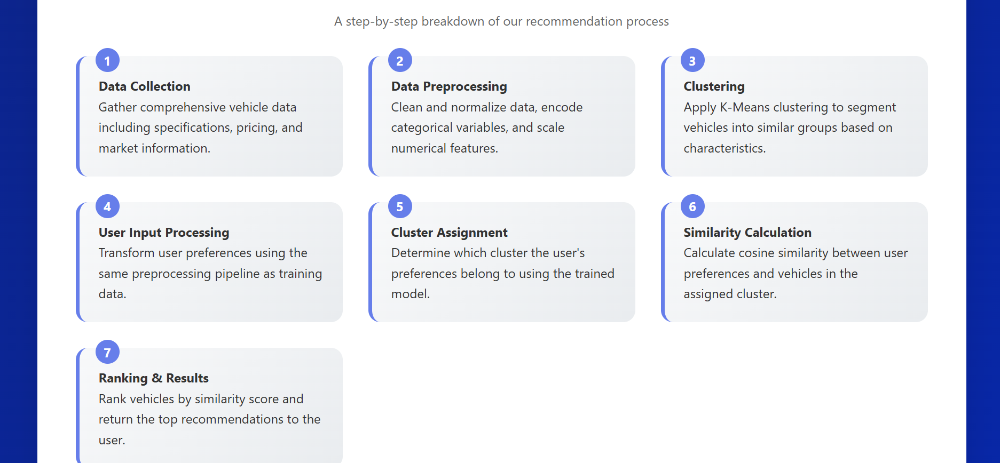

# 🚗 CarMatchPro

**CarMatchPro** is an intelligent car recommendation system built with Flask. It leverages machine learning to match users with cars that align with their preferences such as budget, mileage, engine capacity, fuel type, and more. The system intelligently clusters vehicles and ranks them using similarity scoring.

---

## 📌 Key Features

- 🔍 **User-driven Recommendations** based on price, mileage, age, engine capacity, fuel type, transmission, and assembly.
- 🧠 **Machine Learning Powered** using KMeans clustering and cosine similarity.
- 🔁 **Mock Mode Support** if models/data are not available.
- 🌐 **Responsive UI** built with HTML, CSS, and Flask templates.

---

## 🧠 ML Models Used

| Component | Algorithm | Library | Accuracy / Note |
|----------|-----------|---------|------------------|
| Clustering | `KMeans` | `scikit-learn` | Number of clusters determined via Elbow Method, Silhouette Score ≈ 0.62|
| Similarity Ranking | `Cosine Similarity` | `sklearn.metrics.pairwise` | Custom weighted scoring |
| Preprocessing | `StandardScaler`, `LabelEncoder` | `scikit-learn` | Applied to continuous & categorical features |

> 📂 Models are stored in `/models` (not included in this repo):
> - `kmeans_model.pkl`
> - `scaler.pkl`
> - `label_encoders.pkl` (for fuel, transmission, assembly)

---

## 🧪 How It Works

1. **User Input**  
   The user submits preferences via a web form.

2. **Data Preprocessing**  
   Input is scaled and encoded using the saved pre-fitted scaler and label encoders.

3. **Clustering**  
   The input is assigned to a vehicle cluster using a trained KMeans model.

4. **Similarity Calculation**  
   Cosine similarity is calculated between the user's input and cars within the same cluster.

5. **Recommendation Ranking**  
   Cars are filtered by price range (±10%) and sorted by similarity.

6. **Fallback**  
   If no cars are found, the system intelligently searches in the next closest cluster or falls back to mock recommendations.

---

## ⚙️ Tech Stack

| Layer | Technology |
|-------|------------|
| Web Framework | Flask |
| Frontend | HTML5, CSS3 (Jinja2 Templates) |
| ML Backend | Python (pandas, scikit-learn, joblib, NumPy) |
| Data | Custom dataset of car listings (clustered using KMeans) |
| Deployment Ready | Flask-based WSGI app (`app.py`) |

---

## 🖼 Screenshots

> Below are sample UI views and system architecture diagrams.

| Home Page                      | Home Alternate View             |
| ----------------------------- | ------------------------------- |
|           |            |

| Home Variation                 | Find a Car Page                 |
| ----------------------------- | ------------------------------- |
|          |      |

| Dashboard Overview             | Dashboard Details               |
| ----------------------------- | ------------------------------- |
|      |       |

| Insights View                  | Search Result Page              |
| ----------------------------- | ------------------------------- |
|  |       |

| Tech Stack Diagram             | Working Flow Chart              |
| ----------------------------- | ------------------------------- |
|      |      |

---

## 📬 Contact

For access to the full version (with models and data), or to collaborate:

📧 Email: [syedsaadi427@gmail.com](mailto:syedsaadi427@gmail.com)  
🔗 GitHub: [@syedsaadali11](https://github.com/syedsaadali11)

---
